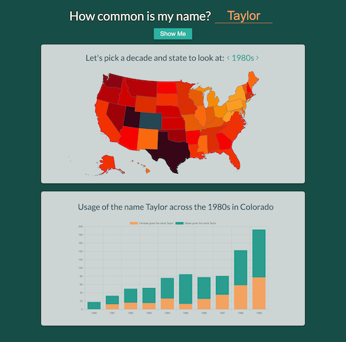

# USA Name History

A fairly small map/chart app that allows you to look up specific names and view their popularity over decades beginning in the 1960s. I created this app using data from the Social Security Admin Available [here](https://www.ssa.gov/OACT/babynames/limits.html).

The map colors are proportional given the total number of baby name instances in a each state. For example, California may have far more instances of a name but stil be lighter than Iowa.

## Running the app locally

    yarn

Then

    yarn dev

You will need a .env file with the database credentials, I'm more than happy to provide those.

This repo was once private, and in my infinite wisdom I'd committed a password that I use in other test projects. So for my own peace of mind I forked it and wiped the commit history.